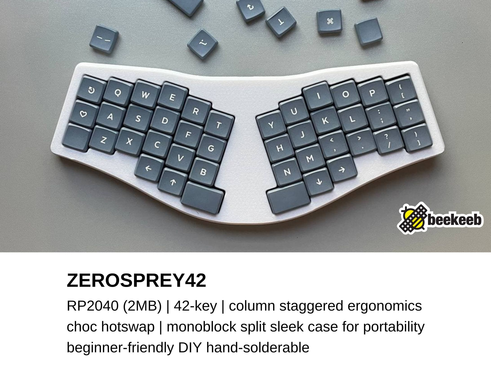
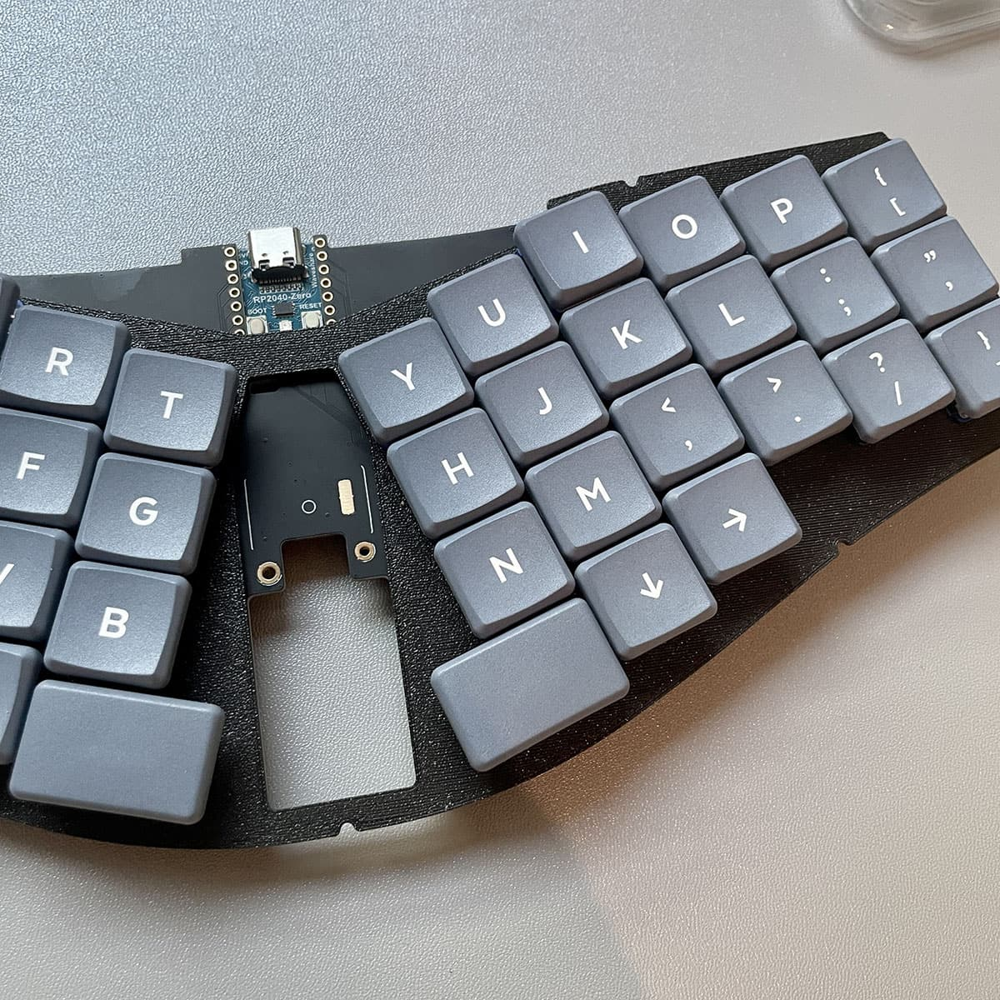
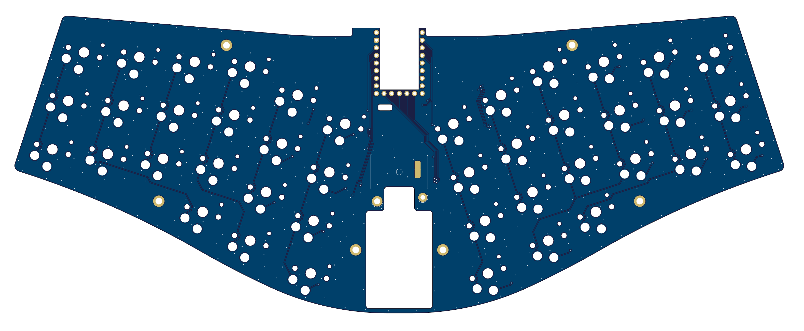
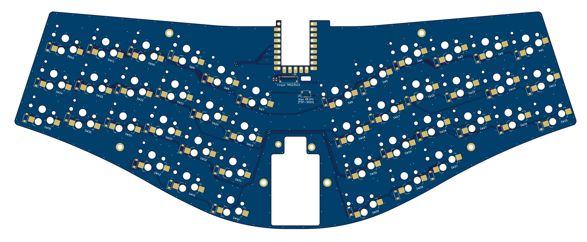

# Zerosprey42 Keyboard

Zerosprey42 Keyboard is a 42-key, wired, beginner friendly, choc v1 hotswap, MonoBlockSplit (Unibody), column-staggered, DIY low-profile mechanical keyboard. It balances between portability and ergonomics with a sleek travel case. This is a remix of ebastler‘s [osprey](https://github.com/ebastler/osprey) with a low cost RP2040-Zero. 

The development of this project is sponsored by [PCBWay](https://pcbway.com/g/beekeeb) (affiliate link).

## Quick Links

* [Build guide](https://docs.beekeeb.com/zerosprey42-keyboard#build-guide)
* [Precompiled firmware](https://docs.beekeeb.com/zerosprey42-keyboard#precompiled-firmware)
* [beekeeb showcase](https://showcase.beekeeb.com/zerosprey42-keyboard/)

## Features

* MCU Board - WaveShare RP2040-Zero
	* It includes a powerful RP2040 MCU with a lot of flash memory (2MB), so you can enable many QMK features and layers without worrying about the firmware size.
* Easier to solder (for the DIY soldering option)
	* There are very few components/pins to solder for the basic version. You will need to solder diodes, hot swap sockets, and the castellated holes for the RP2040-Zero.
* Choc spacing
	* Key switches are arranged tighter than the standard spacing.
* Ergonomics
	* Slightly angled sides, with a bigger thumb key.
* Monoblock Enclosure for Portability
	* There is an elegant case modified from the original osprey keyboard. It includes a top case, switch plate and a bottom case.
* Firmware
	* QMK and Vial are supported. For advanced users, you should be able to use other firmwares including ZMK, KMK (Python-based), PRK (Ruby-based) and keyberon (Rust-based)

## Bill of Materials (BOM)

Quantity | Item | Notes
--- | --- | ---
1 | Zerosprey42 PCB
1 | WaveShare RP2040-Zero
42 | 1N4148 SOD123 diodes
42 | CPG135001S30 hotswap sockets for choc v1 PG1350
42 | choc v1 key switches
42 | choc v1 keycaps | "choc spacing" required

## Ordering Parts

[DIY kits](https://shop.beekeeb.com/product/zerosprey42-monoblock-rp2040-keyboard/) and [prebuilt keyboards](https://shop.beekeeb.com/product/zerosprey42-monoblock-rp2040-keyboard/) are available at https://beekeeb.shop

If you prefer getting the parts by yourself, you can order the PCB from [PCBWay](https://www.pcbway.com/project/shareproject/Zerosprey42_Keyboard_23ae2219.html) or other PCB manufacturers. 

## Firmware

* [QMK](https://github.com/qmk/qmk_firmware)
* [Vial](https://github.com/beekeeb/vial-qmk-zerosprey42) (based on QMK)
* [ZMK](https://github.com/tubbytwins/zmk-config-zerosprey42) by [tubbytwins](https://github.com/tubbytwins)

For advanced users, other firmwares including KMK (Python/CircuitPython), PRK (Ruby), keyberon (Rust) should be possible.

Precompiled firmware can be found at https://docs.beekeeb.com/zerosprey42-keyboard.

## Boards Preview

## License

Logos, external symbols and footprints are not covered by the LICENSE in this repo.

## Sponsors

This open source hardware project is sponsored by

